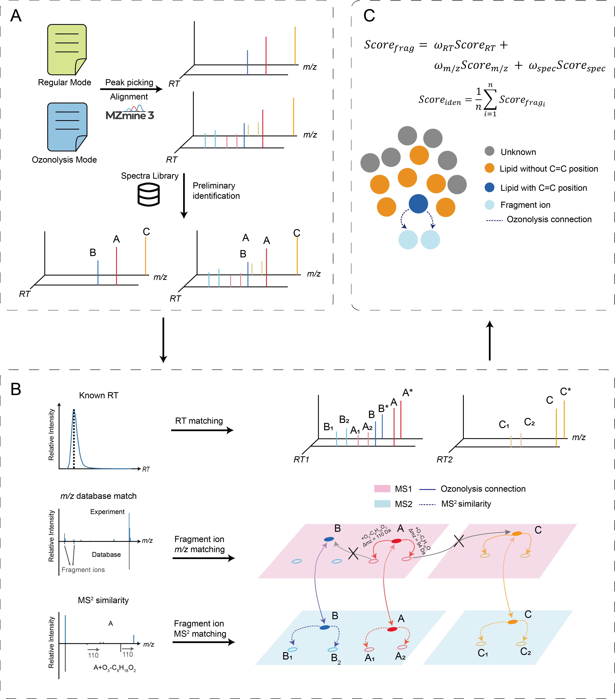

# SILICO-MS: Structure lipidomics analysis using an ionization coupled ozonolysis mass spectrometry strategy

SILICO-MS is a program for automated lipid C=C identification for LC-MS/MS data.

The pipeline of SILICO-MS is as follow:

## Dependence
    pandas
    anndata
    networkx
    matchms

SILICO-MS utilizes fragment similarity scoring, reference lipid structure database and *in-silico* ozonolysis spectra database to achieve lipid C=C identification.

The inputs for SILICO-MS are a MS1 peak table file(.csv), a MS2 spctra file(.mgf), reference lipid structure database(.csv) and an ozonolysis spectra database(.json).

## Run SILICO-MS
    run demo_hela.py

June 2025

RiverLab
