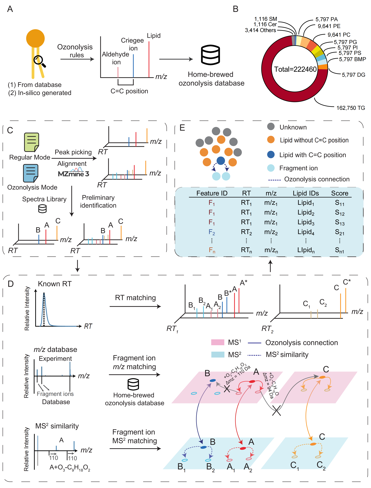

# *SILICO-MS*: Exploring Structural Lipidomic Alterations Using an Ionization-Coupled Ozonolysis Mass Spectrometry Strategy

Official implementation for the paper:

***SILICO-MS*: Exploring Structural Lipidomic Alterations Using an Ionization-Coupled Ozonolysis Mass Spectrometry Strategy**

[](https://doi.org/10.1021/acs.analchem.5c06891)

---

## Overview

SILICO-MS is an **automated lipid structure annotation pipeline** for LC-ESI-OzID-MS/MS lipidomics data.

It integrates:

- In-silico ozonolysis MS/MS spectra prediction
- Fragment similarity scoring
- Retention time & m/z matching
- False positive filtering
- High-confidence lipid C=C location identification

The tool enables systematic, unbiased, and reproducible lipid structural analysis.

The pipeline of SILICO-MS is as follow:



---

## Features

- Automated lipid C=C location identification
- Positive & negative ion mode support
- MS1 peak table + MS2 spectra (mgf) input
- In-silico ozonolysis fragment database matching
- False positive removal using control (CID/N2) data
- Lipid class quantification & statistics
- Hyperparameter optimization & visualization
- Reproducible parameter export (YAML)

---

## Project Structure

```bash
SILICO-MS/
├── silico_ms/ # Core lipid annotation pipeline
├── database/ # Lipid structure & ozonolysis spectra database
├── example/ # Demo datasets (Hela, NIST Plasma, Mouse Liver)
├── requirements.txt # Python dependency list
├── silico_ms_pipeline.png # Workflow diagram
└── README.md # Project description
```

---

## Dependencies

```python
rdkit==2023.9.5
pandas
anndata
networkx
matchms
numpy
pyyaml
seaborn
matplotlib
tqdm
```

---

## Quick Start

### 1. Clone the repository

```bash
git clone https://github.com/JavaScripy/SILICO-MS.git
cd SILICO-MS
```

### 2. Install dependencies

```python
pip install -r requirements.txt
```

### 3. Run demo datasets

```python
python -B demo_hela.py
python -B demo_nist_plasma.py
python -B demo_mouse_liver.py
```

---

## Input Format

- MS1 peak table (`.csv` from MZmine)
- MS2 spectra (`.mgf` format)
- Lipid structure database (`.csv`)
- In-silico ozonolysis database (`.json`)

---

## Output Files

All results are saved in `example/results/`:

- `pos_feature_table.csv` `# Positive mode annotations`
- `neg_feature_table.csv` `# Negative mode annotations`
- `total_feature_table.csv` `# Combined lipid annotations`
- `config.yaml` and `params.yaml` `# Reproducible parameters`

---

## How to Cite

If you use ***SILICO-MS*** in your research, please cite:

**Xu J, Xu X, Hou X, et al. SILICO-MS: Exploring Structural Lipidomic Alterations Using an Ionization-Coupled Ozonolysis Mass Spectrometry Strategy. Anal Chem. 2026;98(9):6741-6751. doi:10.1021/acs.analchem.5c06891**

BibTeX:

```bibtext
@article{
author = {Xu, Jingshen and Xu, Xiaoyan and Hou, Xiaohan and Wang, Ziqing and Gong, Qifan and Guo, Jianhua and Huang, He},
title = {SILICO-MS: Exploring Structural Lipidomic Alterations Using an Ionization-Coupled Ozonolysis Mass Spectrometry Strategy},
journal = {Analytical Chemistry},
volume = {98},
number = {9},
pages = {6741-6751},
year = {2026},
doi = {10.1021/acs.analchem.5c06891},
note ={PMID: 41744231},
}
```

---
